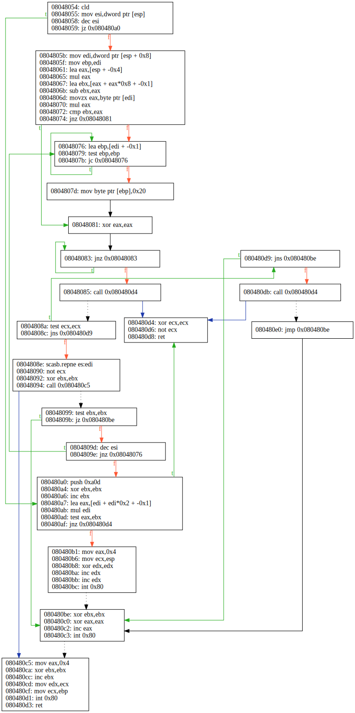

# BBSSE Tutorial 1: Automatically find opaque predicates

In this post, we will analyze the small binary named
[**echo**](../../examples/bbsse/echo) in search of opaque predicates.   
The example can be found in [this directory](../../examples/bbsse).

What are we looking for? In order to make reverse-engineering harder, people
may introduce fake conditional jumps. We are especially looking for
jumps with a test that is always true or always false at runtime.
These jumps can be manually inserted, but also automatically added
with obfuscator tools like
[**ollvm**](https://github.com/obfuscator-llvm/obfuscator) or
[**tigress**](https://tigress.wtf/introduction.html).

To find them out, we will exercise the
**B**ackward **B**ounded **S**tatic **S**ymbolic **E**xecution.  
**BBSSE** in a nutshell? It tries to answer positively to *infeasible queries*
for all paths of a bounded depth that may reach a given predicate.  
You may find interesting to watch our corresponding
[presentation](https://www.youtube.com/watch?v=UU4t0Zvoh-Q) and read our
[S&P 2017 paper](https://binsec.github.io/assets/publications/papers/2017-sp.pdf).

### Requirements

To run to completion we will need:
- a **Linux** environment, preferably on a **x86** machine;
- the **BINSEC** tool (see [install instructions](../../INSTALL.md));
- a SMT solver, preferably [**ocaml-bitwuzla**](../../INSTALL.md#Dependencies)
  (but would work with **bitwuzla**, **boolector**, **Z3**, etc.).

The **Ghidra** software revers engineering suite will be required to run
the **BBSSE** on other binaries. 

### Getting the Control Flow Graph

First thing out, the backward symbolic engine relies on a precomputed
control flow graph of the program under analysis. **BINSEC** uses the
**Ghidra** tool to obtain the initial graph.



For the need of this tutorial, we already saved the **Ghidra** output in
[ghidra.log](../../examples/bbsse/ghidra.log) but here is the command to generate it on demand.

```console
$ binsec -ghidra -ghidra-analyzeHeadless ${GHIDRA_ROOT}/support/analyzeHeadless -ghidra-cache ghidra.log echo
```

Here, `GHIDRA_ROOT` should be set according to installation path of your
**Ghidra**.

### First invocation

Now we have all what we need, we can run **BINSEC** BBSSE with default option.

```console
$ binsec -ghidra-cache ghidra.log -bbsse-process-all-jumps echo
[bbsse:result] 1 / 9: Predicate jz 0x80480a0 at 08048059 deemed clear
[bbsse:result] 2 / 9: Predicate jnz 0x8048081 at 08048074 deemed opaque branch
[bbsse:result] 3 / 9: Predicate jb 0x8048076 at 0804807b deemed opaque fallthrough
[bbsse:result] 4 / 9: Predicate jnz 0x8048083 at 08048083 deemed clear
[bbsse:result] 5 / 9: Predicate jns 0x80480d9 at 0804808c deemed clear
[bbsse:result] 6 / 9: Predicate jz 0x80480be at 0804809b deemed clear
[bbsse:result] 7 / 9: Predicate jnz 0x8048076 at 0804809e deemed clear
[bbsse:result] 8 / 9: Predicate jnz 0x80480d4 at 080480af deemed opaque fallthrough
[bbsse:result] 9 / 9: Predicate jns 0x80480be at 080480d9 deemed clear
[bbsse:info] total predicate                      9
               total opaques predicates           3
               total unreachable predicates       0
               total clear predicates             6
               total unfinished (timeout)         0
             
             total explored paths                 9
             total satisfiability queries         18
                      total cumulative time       0.028075s
```
**BINSEC** processes all the conditional jumps it finds in the target
binary, making a backward step of `1` basic block to check if both branches
of the jump (`true` and `false`) can be taken.

Here, it found 3 predicates that appear to be opaque:
- predicate `0804074: jnz 0x8048081` is always true and so, will take the branch to `0x804081`;
- predicate `0804807b: jb 0x8048076` is always false and so, will fallthrough at `0x80487d`;
- predicate `080480af: jnz 0x80480d4` is always false and so, will fallthrough at `0x8048b1`.

Can we find more?

### Increasing the number of backward steps

Backward bounded analysis is best effort. The more backward context it gathers,
the more it can be precise. In fact, opaque predicates do not have to be local.
They may rely on a distant initialization or on inconsistencies with parent
predicates.

This is the purpose of the option `-bbsse-max-basic-blocks` (default to `1`).
By setting a higher bound (e.g. `3`), **BINSEC** will gather more history,
enumerating all the paths that could lead to the predicate and checking for
their feasibility.

```console
$ binsec -ghidra-cache ghidra.log -bbsse-process-all-jumps echo \
	-bbsse-max-basic-blocks 3
[bbsse:result] 1 / 9: Predicate jz 0x80480a0 at 08048059 deemed clear
[bbsse:result] 2 / 9: Predicate jnz 0x8048081 at 08048074 deemed opaque branch
[bbsse:result] 3 / 9: Predicate jb 0x8048076 at 0804807b deemed opaque fallthrough
[bbsse:result] 4 / 9: Predicate jnz 0x8048083 at 08048083 deemed clear
[bbsse:result] 5 / 9: Predicate jns 0x80480d9 at 0804808c deemed clear
[bbsse:result] 6 / 9: Predicate jz 0x80480be at 0804809b deemed opaque branch
[bbsse:result] 7 / 9: Predicate jnz 0x8048076 at 0804809e deemed clear
[bbsse:result] 8 / 9: Predicate jnz 0x80480d4 at 080480af deemed opaque fallthrough
[bbsse:result] 9 / 9: Predicate jns 0x80480be at 080480d9 deemed opaque branch
[bbsse:info] total predicate                      9
               total opaques predicates           5
               total unreachable predicates       0
               total clear predicates             4
               total unfinished (timeout)         0
             
             total explored paths                 19
             total satisfiability queries         28
                      total cumulative time       0.041755s
```
Here, **BINSEC** found 2 additional opaque predicates.  
So, the more, the better? Why not run it with absurdly high value?

Precision comes at a cost. Each additionnal backward step can increase the
number of paths to reason about in an exponential fashion -- especially
with loops.  
Empirical experiments tend to show that `3` steps offer the best
trade-off between  precision and time.

So, is it all we can do?

### Handling function calls

By default, the backward engine will skip the function calls, replacing them by
a stubs that clobber default caller-saved register (e.g. `eax`, `ecx` and
`edx` for `x86`). This helps scalability, but may introduce false negatives
or, in some corner cases, false positives.

Indeed, it may be necessary to
enter inside the function body to figure out that a predicate is opaque.
This is for instance the case for predicate 5 (`0x804808c`)
which depends on the `ecx` value that is set by the function call at
`0x8048085`.

Let us query the function to be analyzed using `-bbsse-calls-to-proceed`.
```console
$ binsec -ghidra-cache ghidra.log -bbsse-process-all-jumps echo \
	-bbsse-max-basic-blocks 3 -bbsse-calls-to-proceed 0x8048085
[bbsse:result] 1 / 9: Predicate jz 0x80480a0 at 08048059 deemed clear
[bbsse:result] 2 / 9: Predicate jnz 0x8048081 at 08048074 deemed opaque branch
[bbsse:result] 3 / 9: Predicate jb 0x8048076 at 0804807b deemed opaque fallthrough
[bbsse:result] 4 / 9: Predicate jnz 0x8048083 at 08048083 deemed clear
[bbsse:result] 5 / 9: Predicate jns 0x80480d9 at 0804808c deemed opaque fallthrough
[bbsse:result] 6 / 9: Predicate jz 0x80480be at 0804809b deemed opaque branch
[bbsse:result] 7 / 9: Predicate jnz 0x8048076 at 0804809e deemed clear
[bbsse:result] 8 / 9: Predicate jnz 0x80480d4 at 080480af deemed opaque fallthrough
[bbsse:result] 9 / 9: Predicate jns 0x80480be at 080480d9 deemed unreachable
[bbsse:info] total predicate                      9
               total opaques predicates           5
               total unreachable predicates       1
               total clear predicates             3
               total unfinished (timeout)         0
             
             total explored paths                 19
             total satisfiability queries         27
                      total cumulative time       0.041881s
```

Here, we found an unreachable predicate because the only way to reach it
is by following the dead branch of an opaque predicate.

Talking about corner cases, there is actually one example in this binary.
The function call at `0x8048094` clobbers the callee saved register `ebx`
without restoring it before returning. Due to the default stub mechanism,
**BINSEC** is reasoning on the wrong value of `ebx` that lead to
a misclassification. We can avoid this by adding the call site to the calls
to proceed.
```console
$ binsec -ghidra-cache ghidra.log -bbsse-process-all-jumps echo \
	-bbsse-max-basic-blocks 3 \
	-bbsse-calls-to-proceed 0x8048085,0x8048094
[bbsse:result] 1 / 9: Predicate jz 0x80480a0 at 08048059 deemed clear
[bbsse:result] 2 / 9: Predicate jnz 0x8048081 at 08048074 deemed opaque branch
[bbsse:result] 3 / 9: Predicate jb 0x8048076 at 0804807b deemed opaque fallthrough
[bbsse:result] 4 / 9: Predicate jnz 0x8048083 at 08048083 deemed clear
[bbsse:result] 5 / 9: Predicate jns 0x80480d9 at 0804808c deemed opaque fallthrough
[bbsse:result] 6 / 9: Predicate jz 0x80480be at 0804809b deemed clear
[bbsse:result] 7 / 9: Predicate jnz 0x8048076 at 0804809e deemed clear
[bbsse:result] 8 / 9: Predicate jnz 0x80480d4 at 080480af deemed opaque fallthrough
[bbsse:result] 9 / 9: Predicate jns 0x80480be at 080480d9 deemed unreachable
[bbsse:info] total predicate                      9
               total opaques predicates           4
               total unreachable predicates       1
               total clear predicates             4
               total unfinished (timeout)         0
             
             total explored paths                 18
             total satisfiability queries         26
                      total cumulative time       0.043094s
```

This is the best we can do for now analyzing
[**echo**](../../examples/bbsse/echo).

### Discussion

Current version of BBSSE is a complete rework of our original BBSSE. 
Code is smaller, simpler and benefits of recent improvements of the **BINSEC**
platform. 
We are also experimenting some *incremental* analyses. It is actually possible
to pass multiple (coma separated) values to the option `-bbsse-max-basic-blocks`.
The backward engine then tries to prove the predicates are opaque for the smaller
bounds first, and continues with higher bounds only for the non opaque ones.
It could be very beneficial when you expect to have a lot of *very local*
opaque predicates.  
All this brings together, the malware analysis from the S&P 2017 paper runs now
in less than 30 min instead of 1h30 in the original paper (7472 OP detected for
backward depth = `3`), in less than 3 min if we restrict backward depth to 1
(7208 OP detected) and in less than 15 min for incremental mode
(7510 OP detected for backward depth = `1,3`).

Still, loops and function handling are waiting for improvement.
The former prevents the backward engine to find opaque predicates.
The latter may introduce both false negatives and false positives
(especially when functions have a side effect in memory).
Note also that backward engine assumes the precomputed graph is complete.
When it is not the case, false positives may arise.

If interested by these limitations, have a look at the
[S&P 2017 paper](https://binsec.github.io/assets/publications/papers/2017-sp.pdf).

### Conclusion

Congratulation, you successfully learned how to run **BINSEC** backward
symbolic engine to find opaque predicates.

If you are looking for further details about *why the predicates are opaque* and
are not afraid of some reverse-engineering, the 
[oracle](../../examples/bbsse/oracle.txt) file compiles the solution of
all `echo` predicates.

Have a nice day :-)
