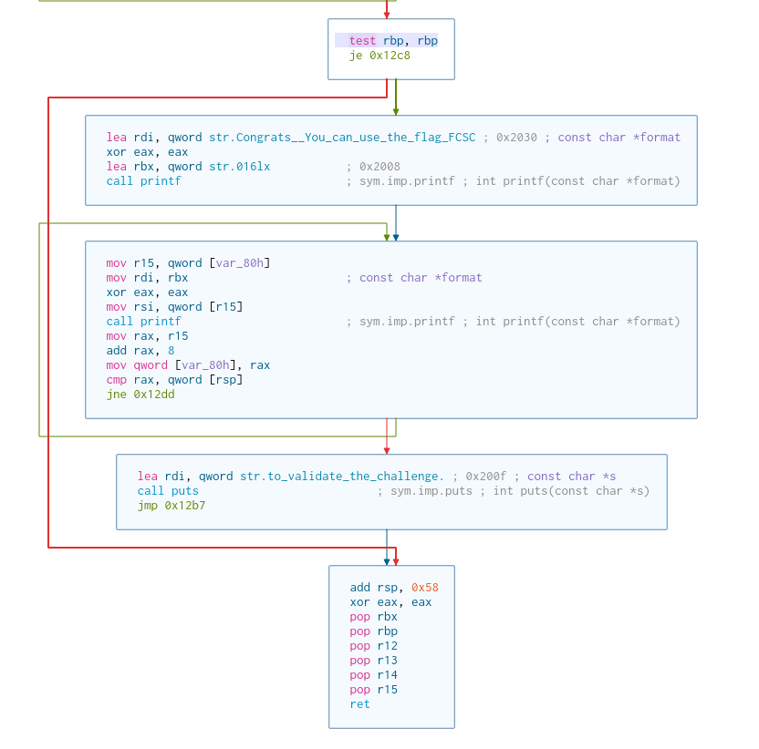
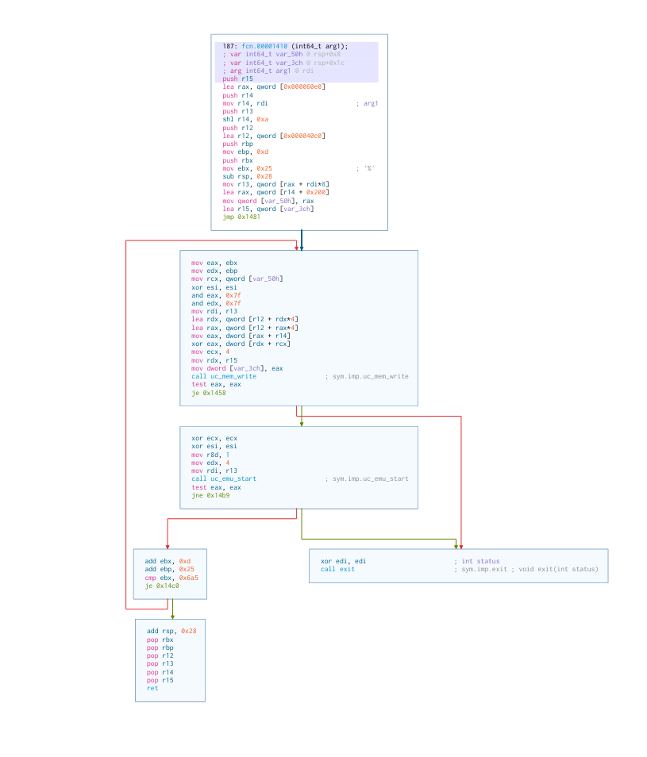

# FCSC 2022 : Licorne

In this paper I ([Mathéo](https://fr.linkedin.com/in/matheo-vergnolle)) explain how I solved FCSC 2022 challenge `Licorne`.
It is a reverse engineering challenge : you are given a binary program called `licorne` (french for "*unicorn*"), and you have to find the input that will trigger a winning message. The method I used relies mostly on [Symbolic Execution](https://en.wikipedia.org/wiki/Symbolic_execution), using a tool called [BINSEC](https://binsec.github.io).

## Tools used

- `binutils`
- `radare2` + `Cutter`
- `gdb`
- `ltrace`
- `BINSEC` + `unisim_archisec`
- `Ghidra`
- `python`

## Basic file analyis

Let's start by finding out what kind of animal this *licorne* is.
```shell
$ file licorne
licorne: ELF 64-bit LSB shared object, x86-64, version 1 (SYSV), dynamically linked, interpreter /lib64/ld-linux-x86-64.so.2, BuildID[sha1]=351fd2bf65ed48bbcae5eaca0f51c15af9017f54, for GNU/Linux 3.2.0, stripped
```
Ok, so no debugging symbols ("*stripped*"), dynamically linked (it does not contain the libraries that it uses), and written in a language that we know (x86-64).

We can search for ascii strings inside the binary
```shell
$ strings licorne
```
We find the usual winning string in two parts : `Congrats! You can use the flag FCSC{` and `} to validate the challenge.`. And there are some unusual names, starting with `uc_`, like `uc_reg_write` or `uc_emu_start`, along with the name of a library that will certainly be highly interesting : `libunicorn.so.2`.
A quick Web search leads us to the [Unicorn Engine](https://www.unicorn-engine.org/), a CPU emulator. On their website, I found a [short tutorial](https://www.unicorn-engine.org/docs/tutorial.html) that teaches you everything you have to know in order to use the lib.

Okay, and now we'll study the behavior of the program  ~~in a secure environment, like a virtual machine~~ directly on our computer because we trust the people at **ANSSI** for not giving us a malware without warnings. At first our *licorne* complains about not finding its (her ? his ?) mother (aka the `libunicorn`), so we [download, build and install](https://github.com/unicorn-engine/unicorn/blob/master/docs/COMPILE.md) the lib and run the program again. We try letters and numbers, but the program does not give any feedback. We only notice that it seems to want 8 numbers (it stops prematurely if it is given something else).

## Trace library calls

Since our program is using an external library, we can learn a lot about it by spying on the library function calls. We do this using `ltrace`
```shell
$ ltrace -o licorne.ltrace.log ./licorne
```
We can then read the log with any file viewer, and see that we have :
1. eight `uc_open` + `uc_mem_map`
2. eight `__isoc99_scanf` (aka `scanf`), properly triggered only in the case where we give numbers, in the other cases the library call exist but we are not prompted for an input
3. 31 times (8 `uc_reg_write` + many (`uc_mem_write` + `uc_emu_start`) + 8 `uc_reg_read`)
4. eight `uc_close`

Now that's we have the general structure of the lib calls, let's go deeper and see what they mean. We'll be using the [Unicorn Engine tutorial](https://www.unicorn-engine.org/docs/tutorial.html), and the source file [uc.c](https://github.com/unicorn-engine/unicorn/blob/master/uc.c).
- `uc_err uc_open(uc_arch arch, uc_mode mode, uc_engine **result)` creates a new processor emulator, with architecture `arch` in mode `mode`, and write the newly created emulator to `result`. In our case, this function is called with the parameters `arch=2` (`ARM64`) and `mode=0` (`MODE_ARM`, to be compared with `MODE_THUMB` for instance). Shame, I don't speak `ARM`, I only know `x86` (and a bit of `Z80`, thanks to the teasing challenge).
- `uc_err uc_mem_map(uc_engine *uc, uint64_t address, size_t size, uint32_t perms)` allocates some memory for the emulator. Our eight calls are in the form `uc_mem_map(<emu>, 0, 1024, 7)`, so we allocate `1MB` of memory at address `0`, with all the permissions (`7=UC_PROT_ALL`).
- `uc_err uc_reg_write(uc_engine *uc, int regid, const void *value)` and `uc_err uc_reg_read(uc_engine *uc, int regid, void *value)` allow to write and read the emulator's register. In our case they are always called with `regid = 199`, which is ARM's register `X0` according to [this file](https://github.com/unicorn-engine/unicorn/blob/master/bindings/dotnet/UnicornManaged/Const/Arm64.fs)
- `uc_err uc_mem_write(uc_engine *uc, uint64_t address, const void *_bytes, size_t size)` writes to the emulator's memory, in our case it always write `size = 4` bytes at address `0`, and take them from the same address on the stack : `bytes = 0x7ffc15501e6c`
- `uc_err uc_emu_start(uc_engine *uc, uint64_t begin, uint64_t until, uint64_t timeout, size_t count)` starts the emulator, in our case it is called with `begin=0`, `until=4`, `timeout=0`, no count. So basically, we just run the emulator on the `4` bytes we wrote juste before. Note that in ARM, every instruction is `4` bytes long, so it seems that we write and run the code instruction per instruction.
- `uc_err uc_close(uc_engine *uc)` finally closes the emulator

We also notice that the 8 processors are always called in the same order, but the values written to `X0` are permuted after each read.

We now have a pretty good idea of what is going on in this program, and yet we haven't looked at any piece of assembly code ! It seems that the program takes our 8 numbers, and does some obsure processing on them using 8 ARM emulated codes. But we don't know how the result is verified, so we'll have to get our hands dirty in order to find it.

## Cutter and GDB

We'll first use `Cutter` (a front-end for `radare2`, the version on my computer dates back to before the fork with `iaito`) to statically disassemble the program. We notice two interesting functions :
- one address `0x000010f0`, that seems to be the `main`function. It contains a loop ran 8 times where `uc_open` and `uc_mem_map` are called. Then another loop ran 8 times where `scanf` is called, and we can see that just before the call, `rdi` is set, through `r13`, to the address of the string "%lu", which confirms that the expected inputs are integers (long and unsigned, to be more precise). Then a great loop ran `31` times and containing 3 smaller loop, each ran 8 times, for `uc_reg_write`, a function at address `0x00001410` and `uc_reg_read`. And finally, at address `0x000012b2`, a check on `rbp` that leads to victory if `rbp` is null : we found it !



- the function at address `0x00001410` is the one doing all the `uc_mem_write` and `uc_start`. But there are some weird operations, including XORs before the call to `uc_mem_write` : the ARM payload is probably obfuscated in the binary



We we'll now do a small dynamic analysis and try to bypass the test on `rbp`. The problem is, since our program is a shared object, it will have different addresses than the one that we can see on Cutter. And since it is stripped, we can not just ask GDB to break on `main`. So here is the trick, we break on `__libc_start_main`, which will take the address of `main` as first argument :
```shell
(gdb) b __libc_start_main
Function "__libc_start_main" not defined.
Make breakpoint pending on future shared library load? (y or [n]) y
Breakpoint 1 (__libc_start_main) pending.
(gdb) r
Starting program: /home/***/Documents/FCSC/Reverse/Licorne/licorne 
[Thread debugging using libthread_db enabled]
Using host libthread_db library "/lib/x86_64-linux-gnu/libthread_db.so.1".

Breakpoint 1, __libc_start_main (main=0x5555555550f0, argc=1, argv=0x7fffffffdac8, init=0x5555555554d0, fini=0x555555555530, rtld_fini=0x7ffff7fe0d50, stack_end=0x7fffffffdab8)
    at ../csu/libc-start.c:137
137     ../csu/libc-start.c: No such file or directory.
(gdb) 
```
Great, so the address of the main function is `0x5555555550f0`. We can then compute that the address of the test on `rbp` is at `0x5555555552b2`. Let's go there and try to fool the unicorn.
```shell
(gdb) b *0x5555555552b2
Breakpoint 2 at 0x5555555552b2
(gdb) c
Continuing.
1
2
3
4
5
6
7
8

Breakpoint 2, 0x00005555555552b2 in ?? ()
(gdb) set $rbp = 0
(gdb) c
Continuing.
Congrats! You can use the flag FCSC{00000000000000010000000000000002000000000000000300000000000000040000000000000005000000000000000600000000000000070000000000000008} to validate the challenge.
[Inferior 1 (process 24854) exited normally]
```
Ok, it works, but it's useless : the flag that we are given is just the concatenation of the inputs we fed the unicorn with. Still, it confirms that our goal is to get `rbp = 0` at this point of the program.

But I am lazy, and I don't want spend time understanding what our *licorne* does with it's food. Enters BINSEC.

## First try with BINSEC

First, let's talk a bit about symbolic execution. The idea behind it is to compute the output of a function as a formula on its input, then ask a [SMT Solver](https://en.wikipedia.org/wiki/Satisfiability_modulo_theories) to find the values of the input that satisfies this formula.

The worklow to use BINSEC is mostly documented through [examples](../../examples/sse). The idea is to make a script with some directives of what you want (reach some point of the program, do not go to some other part, etc.), and then BINSEC will try to find the values that allows you to get there. In the script, you will also be able to write some **stubs** for functions in a language called [DBA](references.md), which allows you to run only the part of a function that is interesting for you, or to have the function create symbolic variables. But there are two problems :
- it can only consider one file (and here we want to got through the `licorne` binary, but also the different libs it uses)
- it starts by default with no concrete variable (especially, if not told anything else, the stack pointer will be symbolic, and can then point anyway in the memory)

These two problems can be solved by running BINSEC on a core dump rather than on the program itself. The core dump can be obtained through GDB. I wrote the necessary commands in [this GDB script](../../examples/sse/fcsc/2022.licorne/command1). You will identify the method we used in the previous part to find the `main`, and also the setting of two environment variables : `LD_BIND_NOW=1` tells the linker to bind the library before the execution, rather than the default behaviour of loading them only when they are called, and `GLIBC_TUNABLES=glibc.cpu.hwcaps=-AVX2_Usable,-AVX2` allows to disable the [AVX2](https://en.wikipedia.org/wiki/Advanced_Vector_Extensions#Advanced_Vector_Extensions_2) instruction set, which is not supported by BINSEC. The script is run by
```shell
$ gdb -x command1 --args ./licorne
```

Now that we have our core dump, we can write a BINSEC script that will use it. Let's first set the directives :
```
starting from core

#the address of the return of the 'main'
return_address<64> := 0x5555555552c7

reach final_test_addr such that rbp = 0 then print model
cut at final_test_addr
```
The `print model` instruction tells BINSEC to print the values it gave to the symbolic variables in order to find the solution. Then, since our input comes from `scanf`, we will have to stub this function in order to make the input symbolic. We'll start with a basic "do nothing" function skeleton :
```
replace <__isoc99_scanf> by
    caller<64> := @[rsp, 8]
    rsp := rsp + 8
    jump at caller
end
```
Then, if we read the man of `scanf`, the first argument is the format, in our case "%lu". And since it matches only one number, the return value should be `1` Let's make sure it is always the case.
```
replace <__isoc99_scanf> by
    caller<64> := @[rsp, 8]
    format<64> := rdi
    assert @[format, 4] = "%lu"z
    rsp := rsp + 8
    rax := 1
    jump at caller
```
The `z` at the end of the format means that the string is zero-terminated. And finally, the result is written at the address pointed by `rsi`, and in our case it will be our symbolic variable, declared with the `nondet` keyword :
```
replace <__isoc99_scanf> by
    caller<64> := @[rsp, 8]
    format<64> := rdi
    assert @[format, 4] = "%lu"z
    resultp<64> := rsi
    @[resultp, 8] := nondet as int_input
    rsp := rsp + 8
    rax := 1
    jump at caller
end
```
Ok, let's try to run our script, using the new Symbolic Execution Engine because it is faster, and with a big exploration depth to be safe :
``` shell
$ binsec -sse -sse-script crackme1.ini -sse-alternative-engine -sse-depth 1000000 core1.snapshot                          
[sse:warning] Cut @ (0x7ffff69402b9, 0) : #unsupported syscall
[...]
```
Ouch, this "unsupported syscall" probably occurs because the emulator is allocating more memory than the one initially present in the core dump. We'll have to find another way.
Note that even if it had worked (and [it can](#bonus)), it would have taken quite a time, because of the emulation. We don't want to stub the whole emulator, so we'll rather try to understand what the emulated code does.

## The emulated ARM code

The ARM code is obfuscated, let's decompile the obfuscation with Ghidra. By giving some meaningful names to the variable and some types to our data, we get a legible result :
```C
void executeARM(long n)

{
  int error_code;
  uint i;
  uint j;
  uint bytes [3];
  undefined8 emu;
  
  j = 0xd;
  i = 0x25;
  emu = (&DAT_001060e0)[n];
  while( true ) {
    bytes[0] = (&DWORD_001040c0)[(ulong)(i & 0x7f) + n * 0x100] ^
               (&DWORD_001042c0)[n * 0x100 + (ulong)(j & 0x7f)];
    error_code = uc_mem_write(emu,0,bytes,4);
    if (error_code != 0) break;
    error_code = uc_emu_start(emu,0,4,0,1);
    if (error_code != 0) break;
    i = i + 0xd;
    j = j + 0x25;
    if (i == 0x6a5) {
      return;
    }
  }
                    /* WARNING: Subroutine does not return */
  exit(0);
}
```
We have two blocs of data, one starting at `001040c0` and another at `001042c0`. By comparing their content with the address that `xxd` gives us in the actual program, we see that in the `licorne` file these addresses correspond to `0x30c0` and `0x32c0`, and that the `.data` bloc ends just before `0x50c0`. We can then extract these two data blocs using `dd`:
```shell
$ dd if=licorne of=bloc1.bin bs=1 skip=$((0x30c0)) count=$((0x50c0 - 0x30c0))
$ dd if=licorne of=bloc2.bin bs=1 skip=$((0x32c0)) count=$((0x50c0 - 0x32c0))
```
It is then interesting to notice that the actual decoding of the arm code depens on the parameter `n` of the function, which seems to be the index of the emulator : our 8 processors run different codes ! After checking in the disassembly that the value of `n` can only be in `[0,7]`, we rewrite the deobfuscation in python, and run the resulting [script](licorne/script.py) to get the 8 corresponding arm codes. But these codes are *blobs*, not executable files, and most of the debugging tools won't work unless they are given an executable format (ELF or PE). After some online research and `man` reading, we find that `objcopy` can do this, using the package `binutils-aarch64-linux-gnu`. The exact command, found after some trials and errors, is
```shell
$ aarch64-linux-gnu-objcopy --input-target=binary --output-target=elf64-littleaarch64 --add-section .text=arm0.bin arm0.bin arm0.elf
```
We now have 8 elf files corresponding to the codes ran by our 8 emulated processors. If we disassemble them with BINSEC (note : you will need to have `unisim_archisec` installed in order to be able to decode aarch64), we see that they all look alike : a big bunch of multiplications, rotations and xoring
```shell
$ binsec -disasm arm7.elf
[disasm:info] Running disassembly
[disasm:result] Entry points: 
[disasm:info] Starting from default entry point 0x00000000
[disasm:info] Using section until 1ff
[disasm:result] Linear disassembly from 0x00000000 to 0x000001ff
[disasm:result] 0x00000000 ca 01 00 21                            eor   x1, x1, x1
                0x00000004 d2 8a d1 a2                            mov   x2, #0x568d
                0x00000008 ca c2 bc 23                            eor   x3, x1, x2, ror #47
                0x0000000c d2 8d 54 42                            mov   x2, #0x6aa2
                0x00000010 ca c2 70 23                            eor   x3, x1, x2, ror #28
                0x00000014 d2 81 f5 82                            mov   x2, #0xfac
                0x00000018 ca c2 cc 23                            eor   x3, x1, x2, ror #51
                0x0000001c d2 9e 2d 82                            mov   x2, #0xf16c
                0x00000020 ca c2 f0 23                            eor   x3, x1, x2, ror #60
                0x00000024 d2 9e f0 82                            mov   x2, #0xf784
[..]
```
We really don't want to go through this mess, so we'll be using binsec to see how the output can be expressed as a function of the input. We do a very simple [script](licorne/emulated-arm.ini) that tells BINSEC to go until the end of the program an prints the formula it found for `X0`. Here we could not use the alternative engine at the time of the challenge, because it did not implement the functionality to print the formula yet :
```shell
$ binsec -sse -sse-script emulated-arm.ini arm7.elf                                                  
[sse:result] Directive :: path 0 reached address 0x00000200 (0 to go)
[sse:result] Formula for x0 @ 0x00000200
             (declare-fun x0_96 () (_ BitVec 64))
             (define-fun x0_197 () (_ BitVec 64)
               (bvsub (bvmul x0_96 (_ bv2193733482345424343 64))
               (_ bv1643298469197263812 64)))
```
BINSEC made some simplifications, and the formula is actually pretty simple : just a multiplication and a substraction with constants! And we have similar results for the 7 other programs, but with different constants. I wonder why the guy who made the `licorne` program had to use an emulator to do this computation, if not for making our life harder. Now that we know what this code does, we'll be able to stub the whole process of emulation, and run BINSEC on the program.

## Solving the crackme

The script is not going to be easily written, so let's set everything up carefully. We'll start from the naive script we wrote before, where only `scanf` was stubbed.

First of all, we have to decide where we will place the addresses of our stubbed processors, and their `X0` register. We can not make arrays in DBA, but we can directly use the memory, so let's choose some random addresses that won't conflict with the other addresses the program uses :
```
processor<64> := 0x561ddc6532a0
x0_val<64> := 0x561ddca0bf80
```
`uc_open` writes to where its `result` arguments (given by `rdx`) points to. We want to write a different address for our 8 processors, so let's add a global variable to count them.
```
proc_count<64> := 0

replace <uc_open> by
    caller<64> := @[rsp, 8]
    resultp<64> := rdx
    @[resultp, 8] := processor + (8 * proc_count)
    proc_count := proc_count + 1
    rsp := rsp + 8
    rax := 0
    jump at caller
end
```
Each of the other function will take the address of the emulator as their first argument, so we can do a routine to check that this address is correct with assertions, which will make troubleshooting easier. The code would look like
```
    emul<64> := rdi
    proc_num<64> := (emul - processor) lsr 3
    assert 0 <= proc_num < 8
```
Where `lsr` is a logical shift, which computes here a division by `8`. The `uc_mem_map` and `uc_close` function do nothing of interest to us, so we can just stub them with a function that only does this check :
```
replace <uc_mem_map>, <uc_close> by
    caller<64> := @[rsp, 8]
    emul<64> := rdi
    proc_num<64> := (emul - processor) lsr 3
    assert 0 <= proc_num < 8
    rsp := rsp + 8
    rax := 0
    jump at caller
end
```
Now, for the `uc_reg_write` and `uc_reg_read` functions, we'll want to check that their first argument is a valid emulator, and that their second argument is `199` (for `X0`). The actual read or write is just a copy between their `result` argument (`rdx`) and our `x0_val` array :
```
replace <uc_reg_write> by
    caller<64> := @[rsp, 8]
    emul<64> := rdi
    proc_num<64> := (emul - processor) lsr 3
    assert 0 <= proc_num < 8
    regid<32> := esi
    assert regid = 199
    valuep<64> := rdx
    @[x0_val + (8 * proc_num), 8] := @[valuep, 8]
    rsp := rsp + 8
    rax := 0
    jump at caller
end

replace <uc_reg_read> by
    caller<64> := @[rsp, 8]
    emul<64> := rdi
    proc_num<64> := (emul - processor) lsr 3
    assert 0 <= proc_num < 8
    regid<32> := esi
    assert regid = 199
    valuep<64> := rdx
    @[valuep, 8] := @[x0_val + (8 * proc_num), 8]
    rsp := rsp + 8
    rax := 0
    jump at caller
end
```
And now the tricky part : we want to stub the function that executes the ARM code, at address `0x555555555410`. It's argument is the number of the processor, between `0` and `7` included. We'll read the current value of `X0` in our `X0_val` array, update it according to the formulas we exhibited in the previous part, then store it back in `x0_val`. To know which formula to apply, we use a `case` structure, which is the DBA code for a `switch` :
```
play_arm_code<64> := 0x555555555410
replace play_arm_code by
    caller<64> := @[rsp, 8]
    proc_num<64> := rdi
    assert 0 <= proc_num < 8
    x0<64> := @[x0_val + (8 * proc_num), 8]
    case proc_num is
        0: x0 := (x0 * 2312467120387208231) + 2029359404220806306
        1: x0 := (x0 * 3797237591153402299) + 47731148168384596
        2: x0 := (x0 * 9790716657430116755) + 5260569239827236637
        3: x0 := (x0 * 14017540565495990065) - 2371969477855754209
        4: x0 := (x0 * 13339645624979120617) + 4567841864047838471
        5: x0 := (x0 * 13151343613722501697) + 9017076464336013363
        6: x0 := (x0 * 2982306705022426789) - 1131089788378275154
        7: x0 := (x0 * 2193733482345424343) - 1643298469197263812
         _: assert false
    end
    @[x0_val + (8 * proc_num), 8] := x0
    rsp := rsp + 8
    rax := 0
    jump at caller
end
```
And finally, the functions `uc_mem_write` and `uc_emu_start` should never be called, since we stubbed the function calling them. Just to make sure we made no mistake, we add a failure directive on them:
```
abort at <uc_mem_write>, <uc_emu_start>
```
Our [script](../../examples/sse/fcsc/2022.licorne/crackme1.ini) is now ready, so let's run it. Obviously, it did not work the first time, I had to debug some type errors, etc. The results comes out really fast :
```shell
$ binsec -sse -sse-script crackme1.ini -sse-alternative-engine -sse-depth 1000000 core.snapshot
[sse:result] Directive :: path 0 reached address 0x5555555552b2 (0 to go)
[sse:result] Model @ 0x5555555552b2
             --- Model ---
             # Variables
             int_input : 0xbddb83056668ad24 0x731c28bd35161a7d
                         0x90923d7a887e728f 0x4866bbe4d32b5947
                         0xe64b8dab82b54783 0x9a0777668fac199e
                         0x199fe9291df0f5ac 0x199c4555cfd54412
             ymm0 : --
             ymm1 : --
             
             -- empty memory --
```
So we have the values that our symbolic variable should take to solve the crackme ! Let's convert them to decimal and check :
```
$ ./licorne                                                                                          
13680672352284224804
8294549406814182013
10417456484546671247
5217063809825069383
16594513019748566915
11098971089058666910
1846450735050454444
1845426182176457746
Congrats! You can use the flag FCSC{bddb83056668ad24731c28bd35161a7d90923d7a887e728f4866bbe4d32b5947e64b8dab82b547839a0777668fac199e199fe9291df0f5ac199c4555cfd54412} to validate the challenge.
```
And that's a victory !

# Bonus

What if we really want to brute force the challenge with **BINSEC**?

As said before, it can take quite a long time because we are going to emulate an emulator. But it is still possible if we figure out that the emulated emulator use *JIT* and allocate a lot of memory.

First, we will start a little bit closer to the point where symbolic values are created (`scanf`), skipping most of the `unicorn` initializations. We can do this by using the second [GDB script](../../examples/sse/fcsc/2022.licorne/command2).
```shell
$ gdb -x command2 --args ./licorne
```

Then, we need to enable support for *self-modifying* code using `-sse-self-written-enum 1`. This way, **BINSEC** will correctly fetch the *JITed* instructions produced by `unicorn`.

Finally, we need to handle the heap growth. To do so, we can *stub* the function `brk` as if the operating system had accepted to increase the heap area.
```
import <brk>, <__curbrk> from libc.so.6

replace <brk> by
  caller<64> := @[rsp, 8]
  @[<__curbrk>, 8] := rdi
  rax := 0
  rsp := rsp + 8
  jump at caller
end
```

To top it all off, we can also *stub* the printing functions such that **BINSEC** will give us the same output as if we had directly run the program.
The full script can be found [here](../../examples/sse/fcsc/2022.licorne/crackme2.ini).

We just have to run **BINSEC** with a depth large enough and take a break.
```console
binsec -sse -sse-alternative-engine -sse-depth 1000000000 \
       -sse-script crackme2.ini -sse-self-written-enum 1 core2.snapshot
```
```
[sse:result] Path 0 reached address 0x5555555552c7 (* to go)
[sse:result] C string stdout : "Congrats! You can use the flag FCSC{bddb83056668ad24731c28bd35161a7d90923d7a887e728f4866bbe4d32b5947e64b8dab82b547839a0777668fac199e199fe9291df0f5ac199c4555cfd54412} to validate the challenge."
```

Have a nice day :-)
